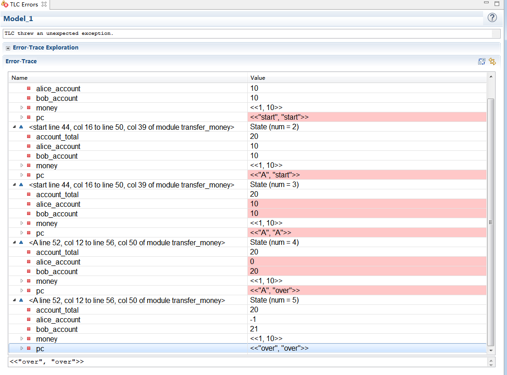
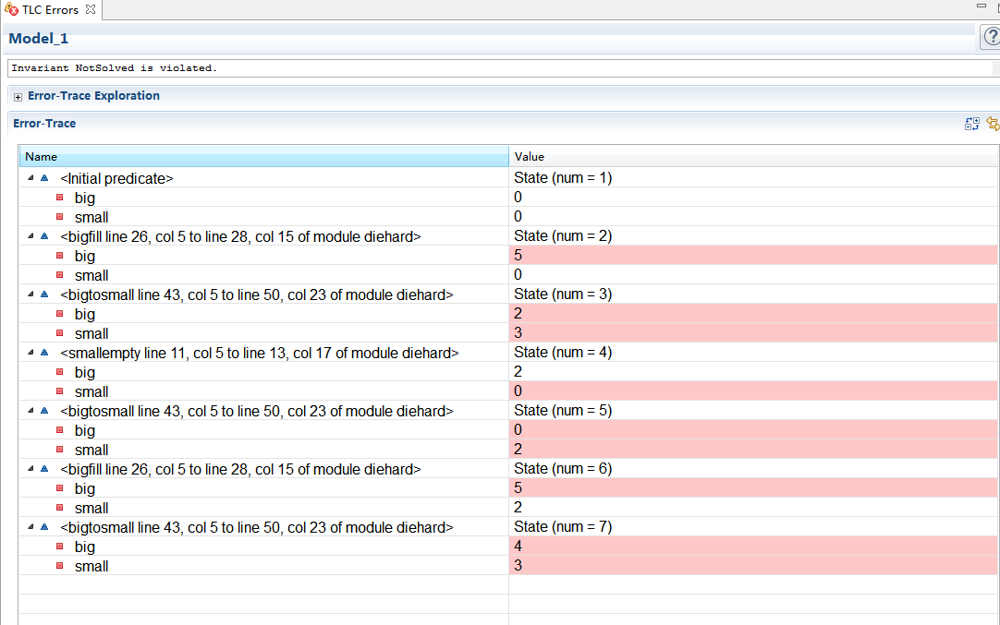

---
layout: post
title: TLA+简介
categories: [TLA+]
description: TLA+学习相关
keywords: TLA+, Math, Algorithm language
---

TLA+的入门，原理

# TLA+简介

[TOC]


## 1. 几个问题(Why)
### 问题样例
#### 例子1

```[TLA+]
---- MODULE transfer_money ----
EXTENDS Naturals, TLC

(* --algorithm transfer {
    variables 
        alice_account = 10, 
        bob_account = 10,
        account_total = alice_account + bob_account;


    process(transaction \in 1..2)
        variable money \in 1..20;
    { 
    start: 
        if (alice_account >= money) 
        { 
            A:  
            alice_account := alice_account - money;
            bob_account := bob_account + money;
        };
    }

}*)

MoneyNotNegative == money >= 0
MoneyInvariant == alice_account + bob_account = account_total

====

```


#### 例子2
DieHard 虎胆龙威。
两个水壶，一个3升容量，一个5升，怎么得到4升水？


### TLA+的检查结果




## 3. TLA+是什么(What)
### 定义
Temporal logic of actions (TLA)
TLA+ is a high-level language for **modeling** programs and systems--**especially concurrent and distributed ones**.  It's based on the idea that the best way **to describe things precisely is with simple mathematics**.  TLA+ and its tools are useful for eliminating fundamental design errors, which are hard to find and expensive to correct in code.  

用数学来精确建模。

[homepage](http://lamport.azurewebsites.net/tla/tla.html)

### 历史
 **temporal logic** 在1957年就提出来了，lamport认为其是abstract nonsence抽象的废话，没有实际应用，实际上是行不通的。 但他认为很有趣，所以继续研究。
后面lamport继续研究可行的实践方法practical method of specification，
1983年"Specifying Concurrent Programming Modules"论文，提出the idea of describing state transitions as boolean-valued functions of primed and unprimed variables. 引入了将状态转换描述为primed变量和unprimed变量的布尔值函数的想法。
1990年temporal logic of actions论文， 1994年正式发布 "The Temporal Logic of Actions" ，TLA enabled the use of **actions** in temporal formulas,是一个优雅的方法。
TLA specifications mostly consisted of ordinary non-temporal mathematics, which Lamport found less cumbersome than a purely temporal specification. 
TLA规范主要由普通的非时间性数学组成，Lamport发现它们比纯时间性规范少了很多麻烦。


**Temporal logic of actions (TLA)** is a logic developed by Leslie Lamport, which combines **temporal logic** with **a logic of actions**. It is used to describe behaviours of concurrent systems.  重点就是在temporal formulas中引入了action。

在微软，亚马逊有很多TLA+应用，且评价很高。

### 理论
##### 抽象定义
去掉非关键部分和实现细节，对关键部分建立模型。

##### 对Disital systems的抽象
Disital systems的连续执行可以被描述为一些离散step的sequence。如时钟的抽象。
TLA用一个state change描述step。
系统的执行，就被描述为step的sequence。
通过随time改变的state来对系统建模。


state：TLA用对variable的赋值来描述state。把各种可能性做乘法得到大量的state。
behaver（状态序列）：  state之间的转换轨迹。 state的一个sequeence。
所以系统的一个执行路径：就被描述为一个behavior。
我们想描述 一个系统的所有执行， 即想描述一个系统的所有可能behavior。


##### state machine
我们可以用state machine来抽象他们。
state machine可以通过如下来描述：
* all possible inital states
* what next states can follow any given state

It halts  if there is no possible next state

###### 用state machine描述的步骤：
1. what the variables are
1. possible initial values of variables
1. a relation between their values in the current state and their possible values in the next state 变量在当前状态下的值 与 下一个状态下值之间的关系

###### 例子
```
int i;                                <-- init state
void main()
{
    i = someNumber();      <-- start state
    i = i+1;                       <-- middle state
}
```

用数学formula来描述state machine： 
* 这个数学表示，不是描述计算的执行指令（即下一步应该do什么），而是formula。It means : if pc = "start" the formula equals the THEN formula, otherwise it equals the ELSE formula. 而不是if pc='start'， do the THEN part.
* formula的值只有true和false
* Next-state formula describes all permitted steps。
```
next-state formula ==   
  IF  pc = "start"
    THEN  (i' \in 0..1000) /\
              (pc = "middle")
    ELSE  IF pc = "middle"
                THEN (i' = i+1) /\
                         (pc' = "done")
                ELSE  FALSE
```
另一种更好的写法：
```
next-state formula == 
          \/  /\  pc = "start"
              /\  i' \in 0..1000
              /\  pc' = "middle"
          \/  /\  pc = "middle"
              /\  i' = i + 1
              /\  pc' = "done"
```

### 基本概念
TLA+ uses several terms which require definition:
* State - an **assignment** of values to variables      值到变量的“赋值”
* Behaviour - a sequence of states
* Step - a pair of successive states in a behavior    behavior内连续的两个state
* Stuttering step - a step during which variables are unchanged     变量未变的step
* Next-state relation - a relation describing how variables can change in any step    描述在step内变量怎么变化的关系（p'=p+1）
* State function - an expression containing variables and constants that is not a next-state relation   没看懂
* State predicate - a Boolean-valued state function
* Invariant - a state predicate true in all reachable states
* Temporal formula - an expression containing statements in temporal logic.  比如Spec就是一个。
* Properties - A property is a predicate on behaviors—that is, it assigns a boolean value (true or false) to every behavior. In TLA+, properties are written as temporal formulas.

* non-primed variables - The meaning of the **non-primed variables** is the variable's value in **this state**. 
* primed variables - The meaning of **primed variables** is the variable's value in the **next state**. 
* action - An action is an **expression** containing primed and non-primed variables, such as x + x' * y = y'.  The above expression means the value of x today, plus the value of x tomorrow times the value of y today, equals the value of y tomorrow.

* [Action]_{variables}
**Statements in temporal logic** are of the form [A]_{t}, where A is an **action** and t contains a **subset of the variables appearing in A**. 
The meaning of [A]_{t} is that **either** A is valid now, or the variables appearing in t do not change. 
This allows for **stuttering steps**, in which none of the program variables change their values.


### TLA+的原理
#### 原理
State就是给变量的赋值（应该就是指某个具体的值）
Init 是初始state
Next-state relation： （也叫next-state action）描述变量在一个step内是怎么变化的。是一个返回bool值的formula。描述的是step。有些是永远返回true的

##### 运作机制
1. 给定Init state 和 Next-state action。 两个都是formula方程式
2. 利用计算机的算力，从init开始暴力解next formula（结果是true的）来搜索下一个state（横向遍历init及Next）
3. 循环往复，最终得到所有sequence of state。 
4. 在该过程中，TLC可以检查是否有next formula失败（返回FALSE），或者检查invariant失败。即是否满足约束条件。


#### 能干啥？
要靠大家探索！
* 逻辑是否完整
* 约束是否满足（deadlock，Termination）

#### 功能
TLA+是基于一阶逻辑(与或非，推导，等价)和集合的基本数学理论的，语言表现性强大，很容易描述复杂的情况。

主要两个功能：
* 通过TLA+或plusCal语言描述建模，
* 通过TLC工具检查。

语言的描述功能是无限的，TLC的检查功能是有限的，只能检查一个子集。

##### TLC Model checker
TLC只能检查TLA+的一部分，要求是finite state and enumerable。
TLC在所有定义的state transtions上进行搜索，当所有state transtion都产生已经发现的state时才停止。 
当TLC发现一个state违背了invariant时就报错。

The TLC model checker builds a **finite state** model of TLA+ specifications for checking **invariance properties**. TLC generates a set of initial states satisfying the spec, then performs a breadth-first search over all defined state transitions. **Execution stops when all state transitions lead to states which have already been discovered**. If TLC discovers a **state which violates a system invariant**, it halts and provides a state trace path to the offending state. TLC provides a method of declaring model symmetries to defend against combinatorial explosion.[14] It also parallelizes the state exploration step, and can run in distributed mode to spread the workload across a large number of computers.[20]

As an alternative to exhaustive breadth-first search, TLC can use depth-first search or generate random behaviours. **TLC operates on a subset of TLA+; the model must be finite and enumerable, and some temporal operators are not supported**. In distributed mode TLC cannot check liveness properties, nor check random or depth-first behaviours. TLC is available as a command line tool or bundled with the TLA toolbox.


## 4.语言语法
参见"语言框架"，"plusCal语法" 文档。


## 5. TLA+ toolbox的使用
使用方法。

## 6. 进一步的学习

**We witnessed first hand the brain washing done by years of C programming**.

##### 链接及内容
* [主页](http://lamport.azurewebsites.net/tla/tla.html)
* [理论Introduction to TLA+](http://lamport.azurewebsites.net/video/intro.html)   作者录得video，一定看看
* [理论State Machines in TLA+](http://lamport.azurewebsites.net/video/smintla.html)  作者录得video，一定看看
* [实践入门，从helloworld开始，层层加码](https://learntla.com/introduction/)  
* [plusCal语法](https://lamport.azurewebsites.net/tla/c-manual.pdf)  
* [specifying system](http://lamport.azurewebsites.net/tla/book.html?back-link=learning.html#book)    里面有讲解TLA+语法，TLC运作机制，怎么描述系统。
* [wiki 引用1] (https://en.wikipedia.org/wiki/TLA%2B)
* [wiki 引用2] (https://en.wikipedia.org/wiki/Temporal_logic_of_actions)


## 7. 我们的应用


